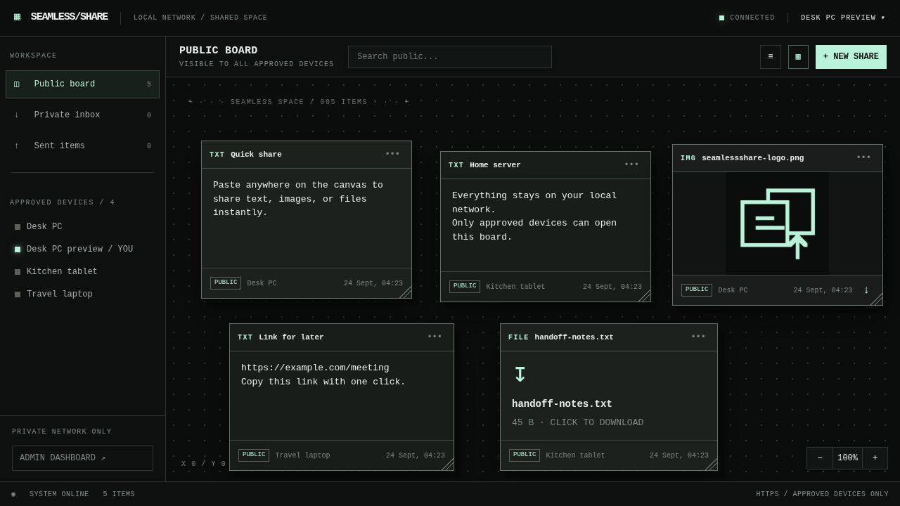
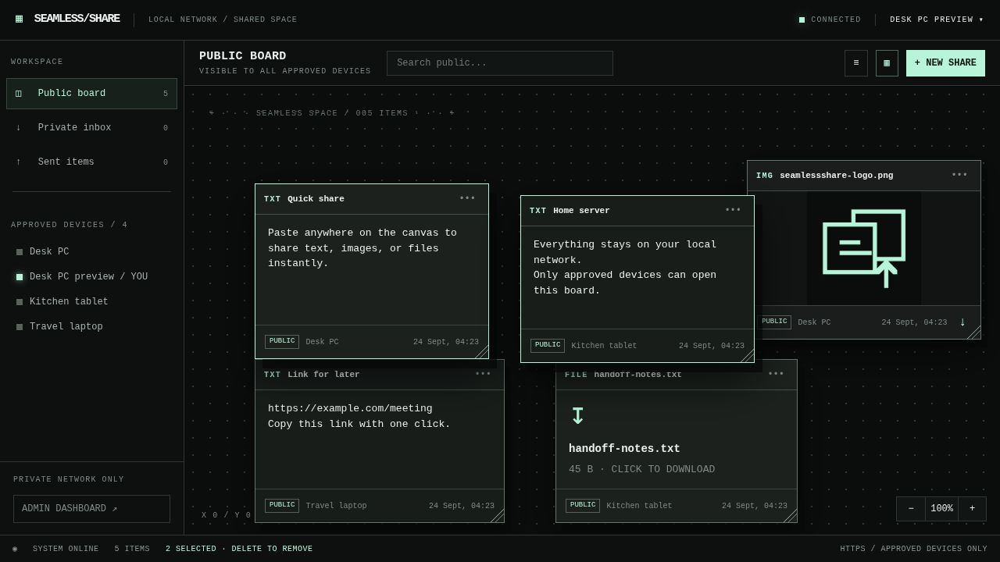
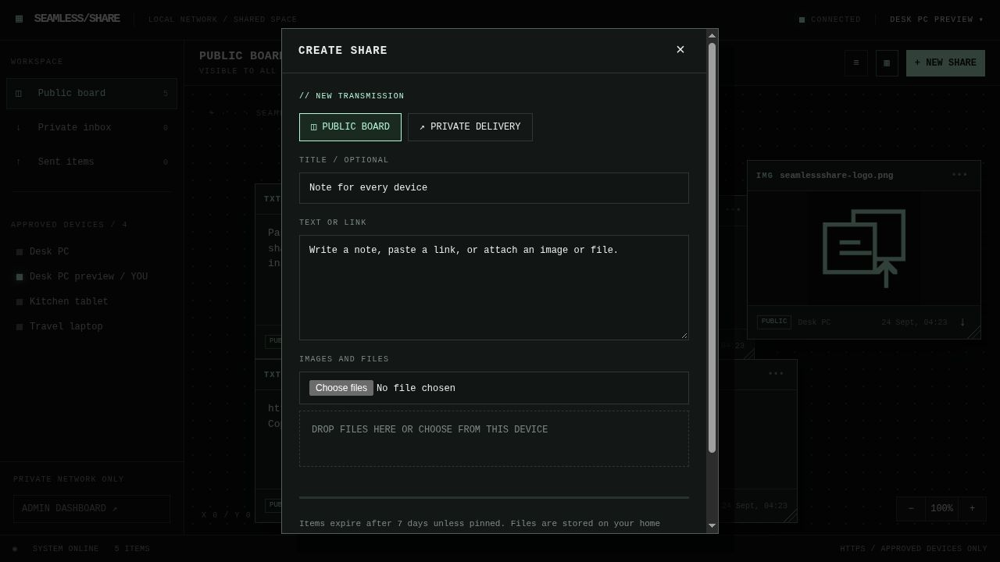
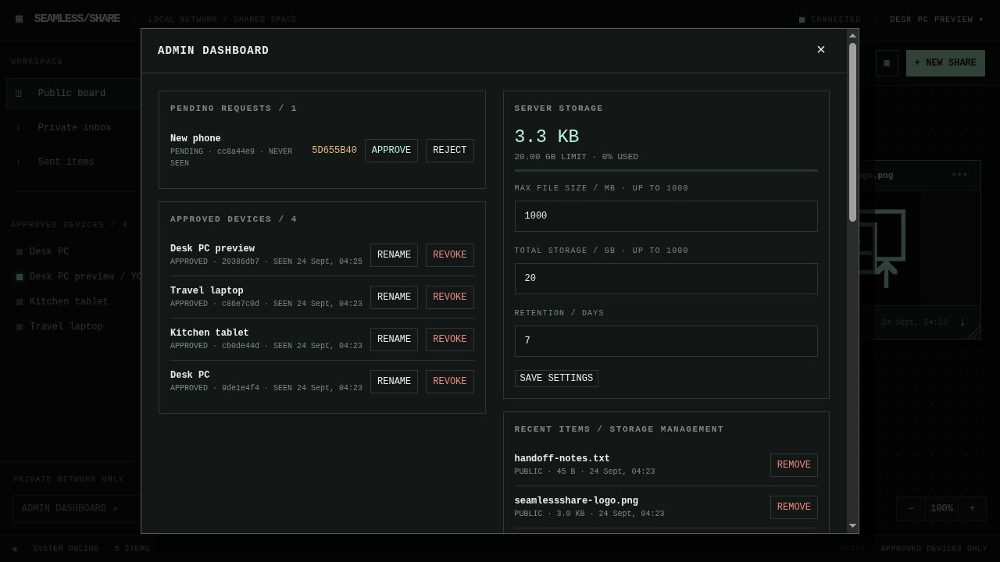

# SeamlessShare

A self-hosted canvas for moving notes, images, and files between approved devices on a local network. Each browser requests approval once. The administrator uses a password; ordinary devices remain paired with a secure cookie.

The backend is ASP.NET Core 10 with SQLite and SignalR. The browser UI is dependency-free JavaScript and CSS, served from the same origin. The application stores files on disk and metadata in SQLite. Nothing is sent to a cloud service.

The current REST API contract is available at `/openapi/v1.json` on a running server. Client device permissions still apply to API calls.

## Screenshots

These screenshots use synthetic sample content. The public canvas holds text, images, and files from approved devices.



Drag across empty space to select several cards, then drag any selected card's header to move the group.



The share composer supports public posts and private delivery. The admin dashboard controls device access and server storage.





## Run on a home server

For CasaOS, import the contents of [`compose.hub.yaml`](compose.hub.yaml) as a custom Docker Compose app. It is self-contained: no separate Caddyfile, `.env` file, or directory setup is needed. Before installing, replace **both** example `192.168.1.50` addresses in Caddy's command with your server's fixed LAN IP or local DNS name. The app will be at `https://<server-address>:8443`. Port 8443 avoids CasaOS's usual web port; if it is already in use, change **both** `8443` values in the Compose file. Keep that port reachable from your LAN.

```yaml
name: seamlessshare

services:
  app:
    image: anthropomorphism/seamless-share:latest
    restart: unless-stopped
    environment:
      ASPNETCORE_URLS: http://+:8080
      SHARE_DATA_DIR: /app/data
      SHARE_TRUST_PROXY: "true"
    volumes:
      - /DATA/AppData/SeamlessShare/data:/app/data
    networks:
      - internal
  caddy:
    image: caddy:2
    restart: unless-stopped
    depends_on:
      - app
    # Change BOTH IPs below to your server's LAN IP or local DNS name.
    entrypoint: ["/bin/sh", "-ec"]
    command:
      - |
        cat > /tmp/Caddyfile <<'CADDY'
        {
          default_sni 192.168.1.50
          auto_https disable_redirects
        }
        https://192.168.1.50:8443 {
          tls internal
          encode zstd gzip
          reverse_proxy app:8080
        }
        CADDY
        exec caddy run --config /tmp/Caddyfile --adapter caddyfile
    ports:
      - "8443:8443"
    volumes:
      - /DATA/AppData/SeamlessShare/caddy-data:/data
      - /DATA/AppData/SeamlessShare/caddy-config:/config
    networks:
      - internal

networks:
  internal:
```

In CasaOS, publish only Caddy's `8443` port and set the app's Web UI link to `https://<server-address>:8443`. Do not publish or open the app container's internal `8080` port directly. Keep `ASPNETCORE_URLS` and Caddy's `reverse_proxy` target on that same internal port. A direct `http://<server-address>:8080` visit cannot retain the production login cookie, so it can appear to accept the password while leaving you signed out. The inline Caddy configuration sets `default_sni` so browsers connecting to a LAN IP through Docker receive the correct certificate.

After CasaOS starts both containers, get the first-run setup token from the **app** container's logs or `/DATA/AppData/SeamlessShare/data/setup-token`. Open the HTTPS address, select **Admin dashboard**, and set an administrator password of at least 12 characters. The token is removed after setup. On another device, open the same address, name that browser, and request access. Compare its verification code with the one in the dashboard before approving it.

The app container is reachable only within the Compose network; Caddy handles LAN HTTPS. Do not forward port 8443 to the internet unless you have reviewed the network and authentication setup for that use.

To update, first back up `/DATA/AppData/SeamlessShare`, then pull and recreate the app through CasaOS. Change the `image:` tag from `latest` to a published version such as `1.2.3` if you want to pin an upgrade. If running the file directly rather than through CasaOS, use `docker compose -f compose.hub.yaml pull && docker compose -f compose.hub.yaml up -d`.

To build from checked-out source instead, copy `.env.example` to `.env`, set `SHARE_HOST`, and run `docker compose up -d --build`. That developer setup uses the separate `Caddyfile` and listens on port 443.

### Trust the local HTTPS certificate

Caddy creates a local certificate authority for this installation. After the first start, copy its root certificate from `/DATA/AppData/SeamlessShare/caddy-data/caddy/pki/authorities/local/root.crt` to each device. You can retrieve it from the CasaOS Files app or copy it on the server:

```sh
sudo cp /DATA/AppData/SeamlessShare/caddy-data/caddy/pki/authorities/local/root.crt /DATA/AppData/SeamlessShare/seamless-root.crt
```

Install and trust `seamless-root.crt` as a **trusted root certificate** on each device that will open the app. On iOS, install the profile and enable full trust in **Settings → General → About → Certificate Trust Settings**. On Android, Windows, macOS, and Linux, use that device's trusted CA installation flow; some browsers also maintain a separate trust store. Use a stable server address: if its IP or hostname changes, update both IPs in Caddy's inline configuration and reconnect using the new address. Never bypass a browser certificate warning as a substitute for trusting the root certificate.

If Firefox reports `SSL_ERROR_INTERNAL_ERROR_ALERT` for a LAN IP, make sure Caddy is using the inline configuration above, including `default_sni`, with both addresses set to the LAN IP. The older `caddy reverse-proxy --from ...` command can fail to select a certificate behind Docker networking. This happens before certificate trust can be checked; installing the root certificate alone will not fix it.

HTTPS is needed for reliable clipboard access, PWA installation, and phone share integration. Text copy works on a click where the browser permits it. Images can be copied where supported. Files are downloaded; browsers do not offer consistent arbitrary-file clipboard writes. The PWA can appear as a phone share target where the operating system and browser support that feature. If it does not, open the app and paste or select files normally.

## Use

- **Public board:** every approved device can read all public items and move/resize their cards. Only the sender can edit text, pin, or delete; the administrator can delete any item.
- **Private delivery:** select one or more approved recipient devices. Only the sender and those recipients can retrieve the content through the app. Queued items remain on the server while a target device is offline. The sender sees queued, available, and opened states.
- **Expiry:** items expire after seven days by default. The sender can pin an item indefinitely or unpin it to start a fresh retention period. The dashboard can change retention, per-file limit, and total storage capacity. Defaults are 1 GB per file and 20 GB total.
- **Canvas:** drag a card by its header and resize it from the lower-right corner. The newest card starts on top; selecting a card brings it forward. Drag empty canvas space to select all cards in a rectangle, or Ctrl/Command-click cards to add to a selection. Drag the header of any selected card to move the entire selection together. Delete (Backspace on some keyboards) removes selected shares sent from this device after confirmation. The wheel scrolls vertically; Shift + wheel scrolls horizontally. Use Space + drag or the middle mouse button to pan; middle-click paste is disabled in the app. Touch drag pans on touch devices. Right-click empty canvas space to add a share at that position. Pasting text or files on the public board shares them immediately without opening the composer. Mobile defaults to the list view. The search box filters the current view without case sensitivity. Text and image card bodies copy on click; file cards download on click, and image cards have a separate download button. The approved-device indicator is green while a device is connected and grey when offline.

Each browser profile is a separate device. Clearing browser data means requesting approval again. Administrators can revoke a device at any time. The home server is trusted with readable files and text; private delivery controls app access but is not end-to-end encryption.

## Data, recovery, and upgrades

The CasaOS installation keeps the SQLite database, uploads, and Caddy's local certificate authority under `/DATA/AppData/SeamlessShare`. Stop the app in CasaOS and back up that entire directory before upgrades or migration:

```sh
sudo tar -czf seamlessshare-backup.tar.gz -C /DATA/AppData SeamlessShare
```

Restore the whole directory together to preserve pairing and certificate trust. Also retain your administrator password. For the source-build Compose setup, back up its `data/` directory and `caddy_data` Docker volume instead. On first release, SQLite tables are created automatically. Before upgrading a deployed version, check the release notes for any schema migration.

To reset an administrator password, open a shell in the **app** container from CasaOS and run `dotnet SeamlessShare.dll --reset-admin-password`. Enter and confirm the new password at the prompt. Existing administrator sessions are signed out. This command does not change paired devices or shared items.

## Docker Hub publishing

The workflow in `.github/workflows/docker-publish.yml` builds Linux AMD64 and ARM64 images and pushes them to `anthropomorphism/seamless-share`. A push to `main` publishes `latest` and a commit SHA tag. Pushing a version tag such as `v1.2.3` publishes `1.2.3` and a commit SHA tag. You can also run the workflow manually from GitHub Actions. The Docker Hub account must have permission to push to that repository, and its access token must be saved as the GitHub repository secret `DOCKER_HUB_TOKEN`.

## Local development and verification

With .NET 10 installed:

```sh
ASPNETCORE_ENVIRONMENT=Development dotnet run --urls http://127.0.0.1:5188
```

Development mode allows non-Secure cookies for localhost testing. Keep that mode bound to localhost. Production uses Secure cookies behind Caddy. The integration test exercises initial setup, multiple browsers, approval and revocation, private isolation, acknowledgement, and file upload/download against a **fresh disposable** data directory:

```sh
ASPNETCORE_ENVIRONMENT=Development SHARE_DATA_DIR=/tmp/seamless-test dotnet run --urls http://127.0.0.1:5188
# In another terminal, after startup:
python3 tests/integration.py http://127.0.0.1:5188 /tmp/seamless-test/setup-token
```

The test creates its own administrator password and test devices. Never point it at an existing installation.
